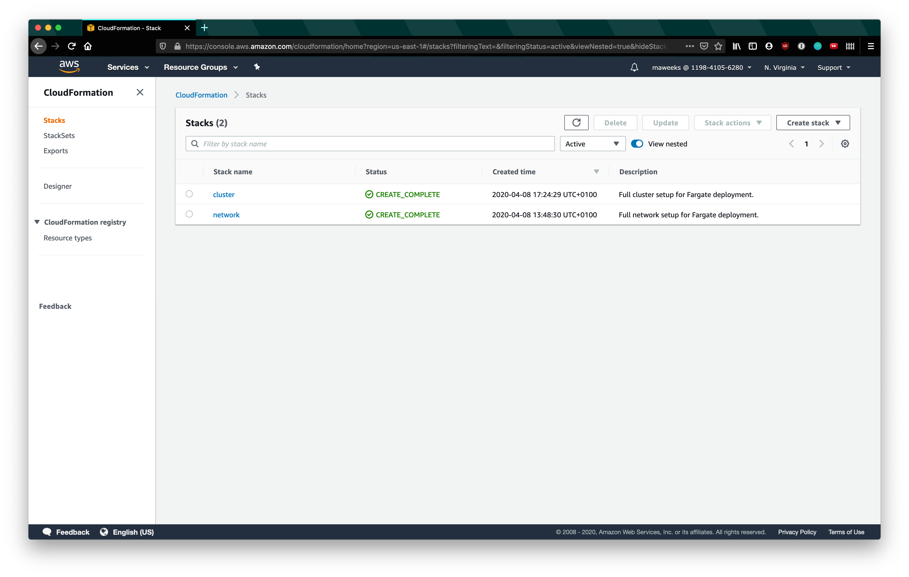
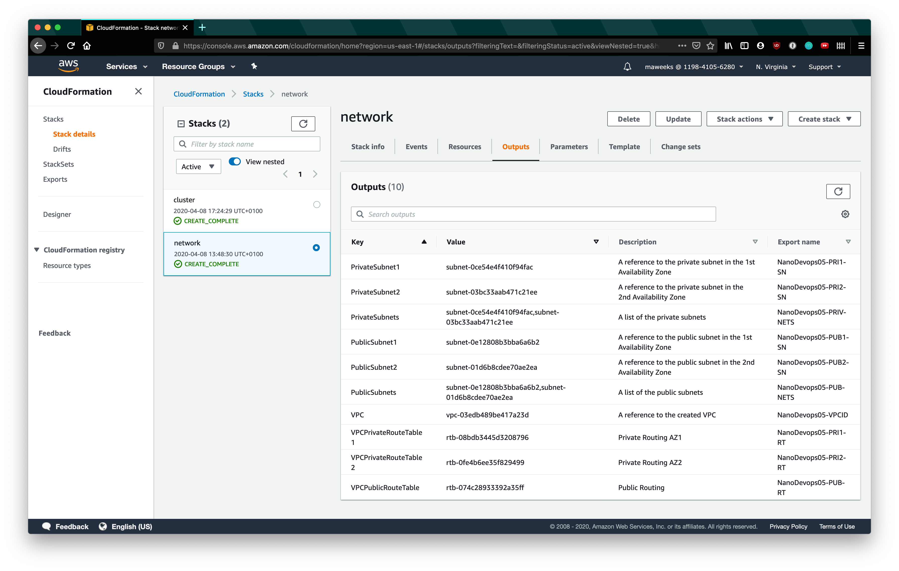
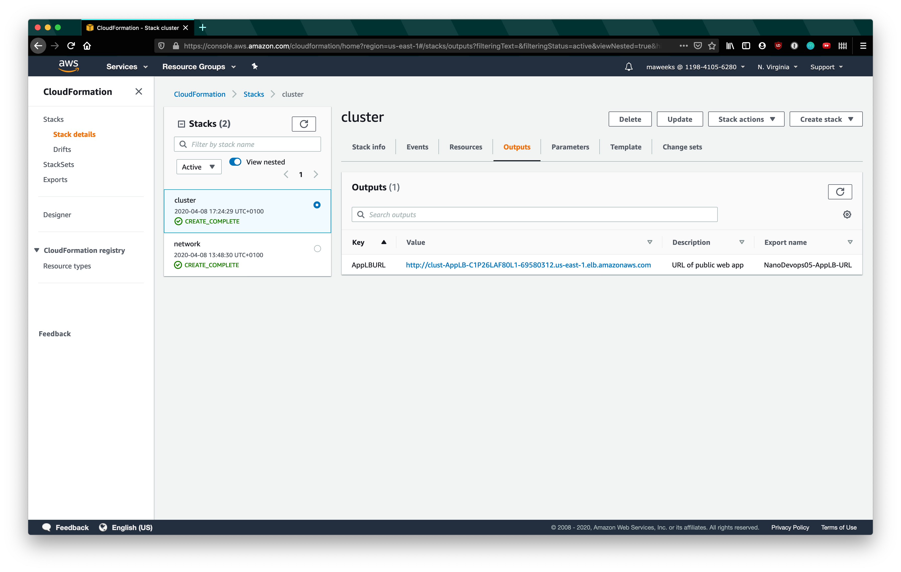
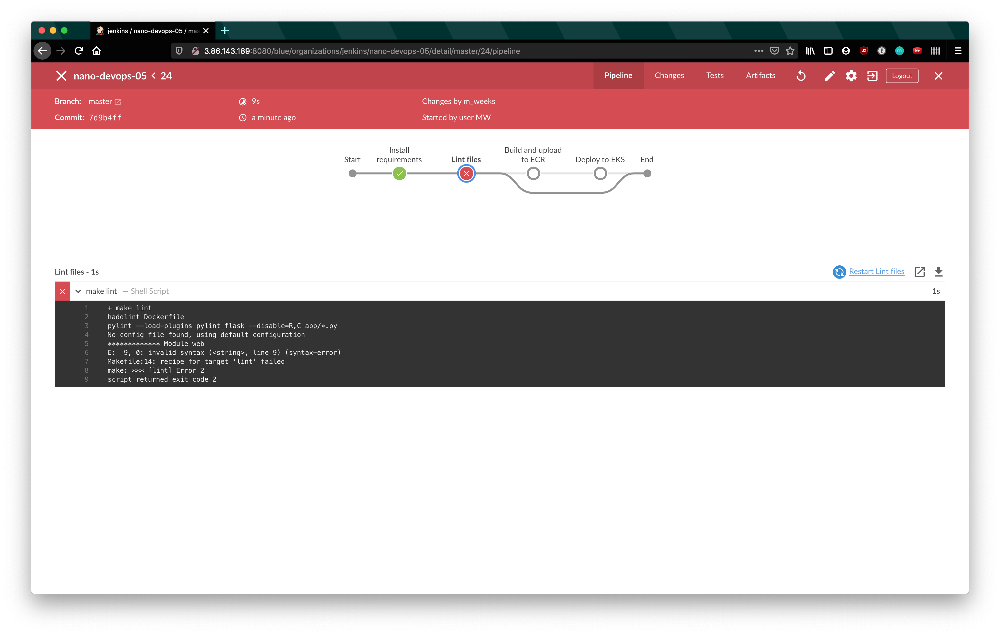
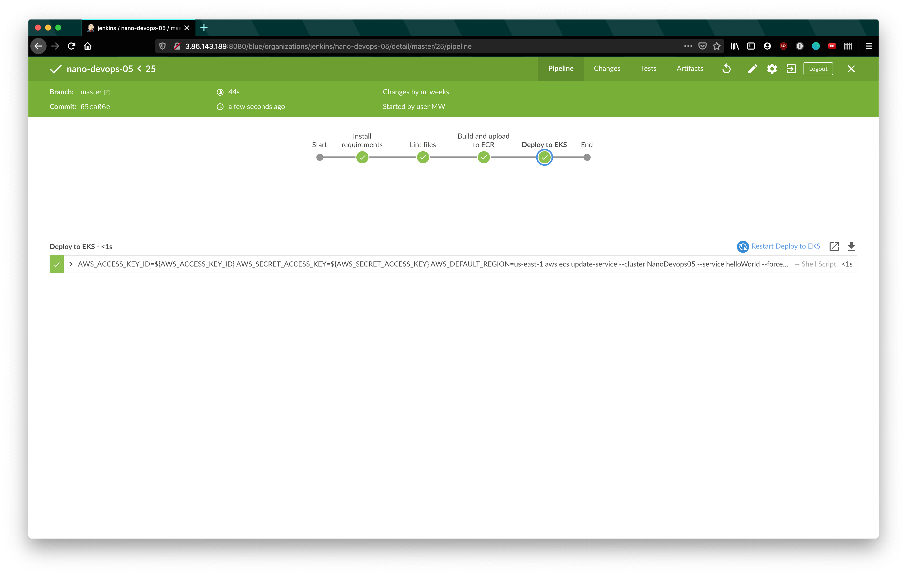
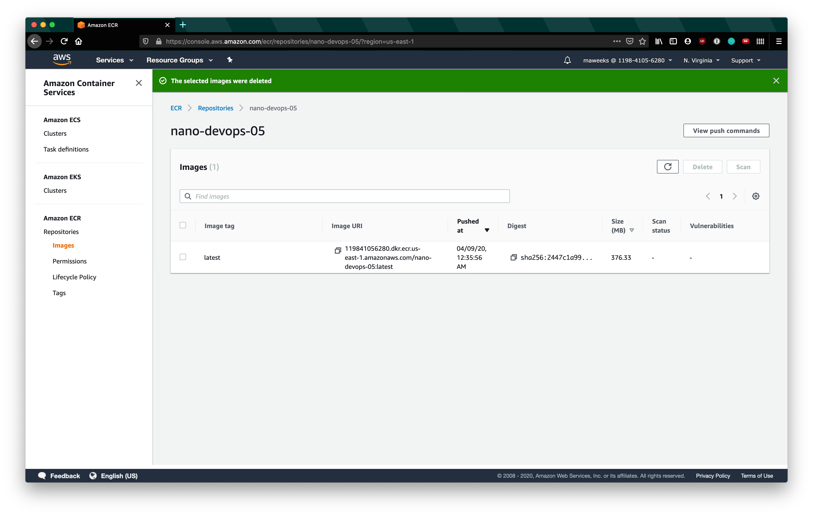
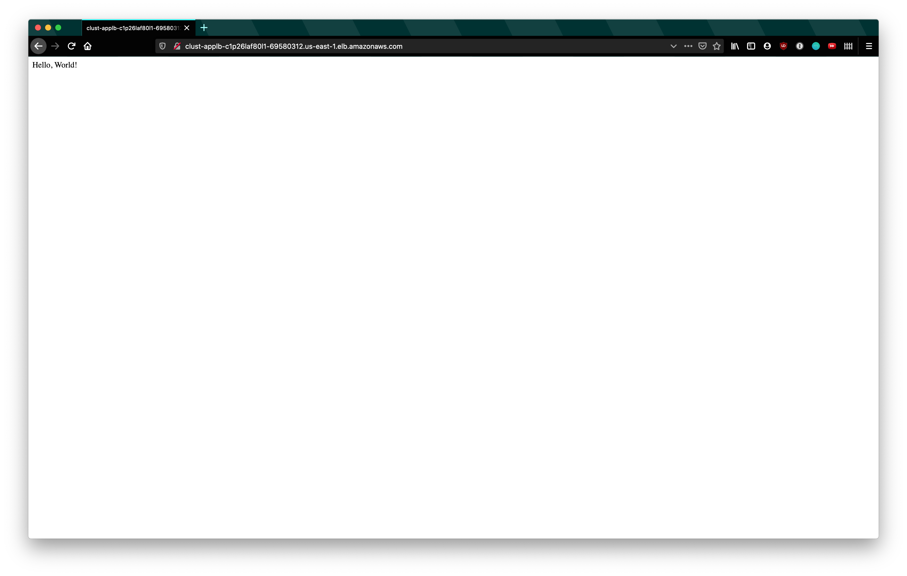

# Capstone Project (Cloud DevOps Engineer)

Capstone project for Udacity Dev-Ops Nanodegree: develop a CI/CD pipeline for micro services applications with either blue/green deployment or rolling deployment.

## CI CD Pipeline

The CI CD pipeline is as follows for this project. For initial set up:

- Set up jenkins
- Install dependencies for local development
- Create AWS infrastructure

For application development:

- Make development change
- Commit to git
- Update AWS stack using `./awsCoUp.sh` commands listed below if required
- Push to repository
- Jenkins build automatically runs based on triggers
  - Files are linted
  - Docker image build and uploaded to ECR
  - ECS tasks updated to run new Docker image using rolling deployment

## Running the stuff

There is a `Makefile` that contains lots of useful commands.
Running `make` will list them, like the below output.

```text
help:           Show this help.
setup:          Create the virtial environment to run this project
env:            List the environment versions
lint:           Check the validity of the project files
test:           Run the tests for this prject
install:        Install the required imports for this project
docker-build:   Build the docker image and list available docker images
docker-upload:  Upload the docker image to AWS
start-api:      Run the python application locally
```

## Creating the infrastructure

From the base of this repository run the following to create or update the deployment.

```bash
aws configure # set to credentials with appropriate access
cd scripts; ./awsCoUp.sh network ../cloudformation/01-network.yml ../cloudformation/01-network-parameters.json; cd ..
# Wait for the network stack to be complete
cd scripts; ./awsCoUp.sh cluster ../cloudformation/02-cluster.yml ../cloudformation/02-cluster-parameters.json; cd ..
```

## Jenkins set up

Full jenkins set up details can be found in `jenkinsSetup.md`.

## Output

From running the above the following will be created.

The application is currently running [here](http://clust-applb-c1p26laf80l1-69580312.us-east-1.elb.amazonaws.com/) is a link to the load balancer.

AWS Stacks:






Jenkins build when the lint fails:


Jenkins build when the lint passes and deploys to ECR:


ECR with new image uploaded:


Hello world application running:


<h3>Author</h3>
<a href = "https://github.com/qasim1020/Capstone-Project-Devops">GitHub</a>
